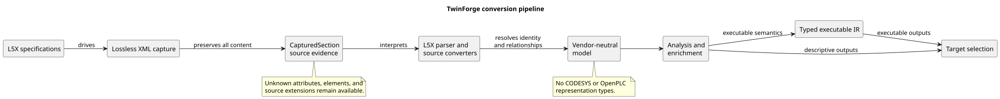
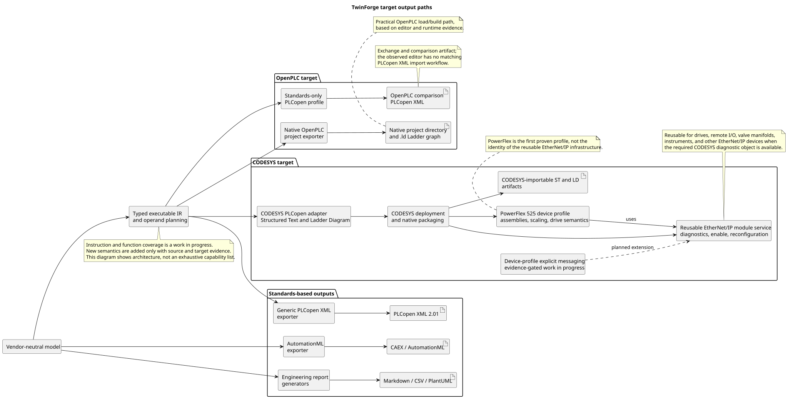
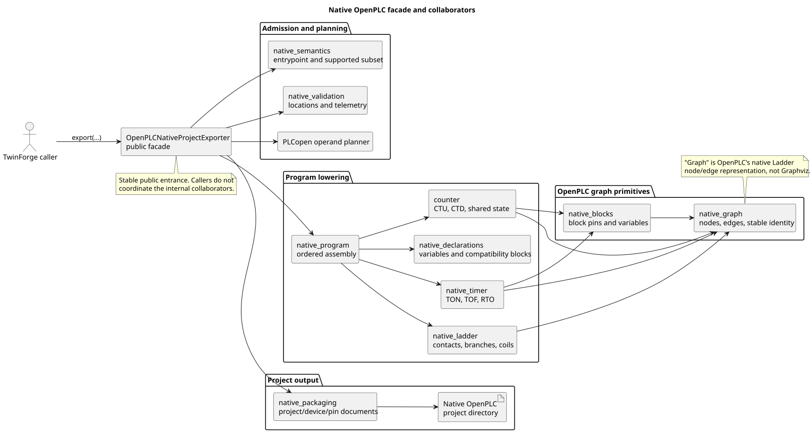

# Architecture

TwinForge separates source-specific capture from its vendor-neutral model and
output formats.

## Architecture diagrams

### End-to-end conversion pipeline



[PlantUML source](docs/architecture/diagrams/conversion-pipeline.puml)

### Target-specific output paths



[PlantUML source](docs/architecture/diagrams/target-output-paths.puml)

### Native OpenPLC façade and collaborators



[PlantUML source](docs/architecture/diagrams/openplc-native-facade.puml)

The `.puml` sources are authoritative. The adjacent SVG files are tracked so
GitHub can render the diagrams without a PlantUML service or browser plugin.
The diagrams describe responsibility and data-flow boundaries rather than a
fixed feature inventory. CODESYS conversion is validated for both Structured
Text and Ladder Diagram, while instruction and function coverage continues to
expand through evidence-backed implementation and testing.

```text
L5X specification tables
        ↓
generic XML capture
        ↓
CapturedSection
        ↓
L5X converters
        ↓
Plant / Controller domain model
        ↓
analysis and enrichment
        ↓
PLCopen XML | AutomationML | reports
```

## Package responsibilities

| Package | Responsibility |
| --- | --- |
| `schema.l5x` | Declarative L5X element and attribute specifications |
| `parsers.l5x` | Generic, lossless XML capture |
| `converters.l5x` | Source-specific conversion and reference resolution |
| `model` | Vendor-neutral domain objects and source provenance |
| `analysis` | Coverage and relationship analysis |
| `structured_text` | Lossless ST syntax and semantic analysis |
| `ir` | Typed, vendor-neutral executable representation and normalization |
| `runtime` | Runtime contracts and executable reference behavior |
| `exporters` | Generic IEC, PLCopen XML, AutomationML and report generation |
| `targets` | Runtime-specific adapters and deployment packaging |
| `assembly` | Controller/document assembly and software-device resolution |
| `transport`, `discovery` | CIP communication and live acquisition |

PLCopen export is divided into target-neutral types, RLL parsing, XML/value
helpers and validation, project orchestration, plus target adapters. A
pre-serialization operand planner discovers portable symbols, comparison
temporaries, timers and one-shots without constructing XML. A separate
variable emitter serializes supported tag types, initial values and retained
source evidence with the target timer type supplied as policy. Generic
project scaffolding and controller traversal delegate target application
wrapping through an injected callback. Typed instruction dispatch separates
opcode-to-emitter selection from rung graph ordering and carries explicit
block-continuation state. CODESYS project structure and extensions are
isolated in `exporters.plcopen_codesys`; a future OpenPLC adapter should
consume the same neutral conversion and emission services.

AutomationML export is divided into instance-hierarchy construction,
class-library generation, signal/I/O generation, deterministic identity, CAEX
XSD validation and semantic-reference validation. `AutomationMLExporter`
remains the serialization and filesystem façade.

Architecture status, active hotspots, dependency rules and refactor completion
criteria are maintained in the
[architecture and refactoring roadmap](docs/roadmaps/architecture-refactoring-roadmap.md).
The general PLCopen and CODESYS IR exporters are established boundaries but
remain active decomposition targets as their supported behavior expands.
CODESYS IR project-integration configuration and naming/default policies are
kept separately from XML serialization in `exporters.codesys_ir_integration`.
Reusable-unit POU interfaces and datatype encoding are isolated in
`exporters.codesys_ir_pou`, with lifecycle and identity behavior supplied
through narrow callbacks.
CODESYS lifecycle eligibility and native method emission are isolated in
`exporters.codesys_ir_lifecycle`; the exporter consumes that single policy
for diagnostics, POU content and project-tree metadata.
CODESYS IR library discovery, native metadata and Library Manager identity
are isolated in `exporters.codesys_ir_libraries`.
`CodesysIRPLCopenExporter` remains the stable façade over these collaborators;
fixed-time regression fixtures protect byte-stable import structure and
deterministic CODESYS object IDs.

The PowerFlex 525 executable core is target-neutral in
`exporters.powerflex525_core`. CODESYS device composition is owned by
`targets.codesys.powerflex525`; compatibility aliases preserve the former
public exporter API while dependency tests protect the neutral boundary.

The CODESYS EtherNet/IP module-service adapter is reusable infrastructure, not
a PowerFlex-only implementation. Its validated boundary normalizes remote
adapter diagnostics, enable state, fault state, diagnostic text, and
capability-gated reconfiguration. Device profiles separately own assembly
instances and sizes, cyclic data layouts, scaling, command/status semantics,
and electronic keying. The PowerFlex 525 profile is the first proven consumer
of that infrastructure. Device-specific parameter access and explicit
messaging remain evidence-gated profile work; they are not yet asserted as a
generic EtherNet/IP messaging implementation.

Generated Python packaging metadata such as `*.egg-info/` is not source and
is intentionally excluded from version control. Package configuration is
owned by `pyproject.toml`.

Architecture tests enforce that neutral model and IR modules do not import
conversion or target layers. Exporter-to-target imports are restricted to
documented compatibility surfaces, and public package exports must be unique
and resolvable.

`targets.openplc` exposes a standards-only PLCopen 2.01 façade and a separate
native project-directory packager, with no direct CODESYS dependency or
emitted CODESYS metadata. The native packager currently accepts only the
evidenced local-BOOL serial and two-path parallel Ladder subset, canonical
Rockwell `TON` and `TOF`/`.DN` pairs, and optional `%MD` `TON` elapsed-time
telemetry. The evidenced adjacent Rockwell `RTO`/`.DN`/`RES` group is lowered
through a generated, target-owned `TF_RTO` compatibility function block. It
rejects other semantics before writing a partial project. Native OpenPLC
editor/runtime compatibility is expanded only after editor, compiler, and
runtime evidence—not by inferring that superficially similar blocks are
interchangeable.

## Invariants

- Unknown source data is preserved.
- Exporters do not parse L5X.
- Source-specific conventions carry explicit provenance.
- Absence of source evidence is not treated as a false fact.
- Model identity and relationships are resolved before export.
- Standard XML validation and semantic reference validation are separate.

## Export architecture

PLCopen XML represents executable IEC 61131-3 project content. AutomationML
represents plant/controller/module/signal context and references PLCopen XML
through the standard `PLCopenXMLInterface`.

```text
AutomationML CAEX hierarchy
├── controller, chassis and modules
├── I/O interfaces and process signals
├── RoleClass / InterfaceClass / AttributeType libraries
├── vendor-neutral and catalog SystemUnitClasses
└── PLCopenXMLInterface → PLCopen XML document
```

## Deferred architecture

- live CIP reconciliation with offline L5X;
- physical Channel and CIP Assembly objects;
- multi-controller communication graphs;
- external protocol maps such as Modbus;
- hardware capability profiles beyond recognized source/catalog evidence.
